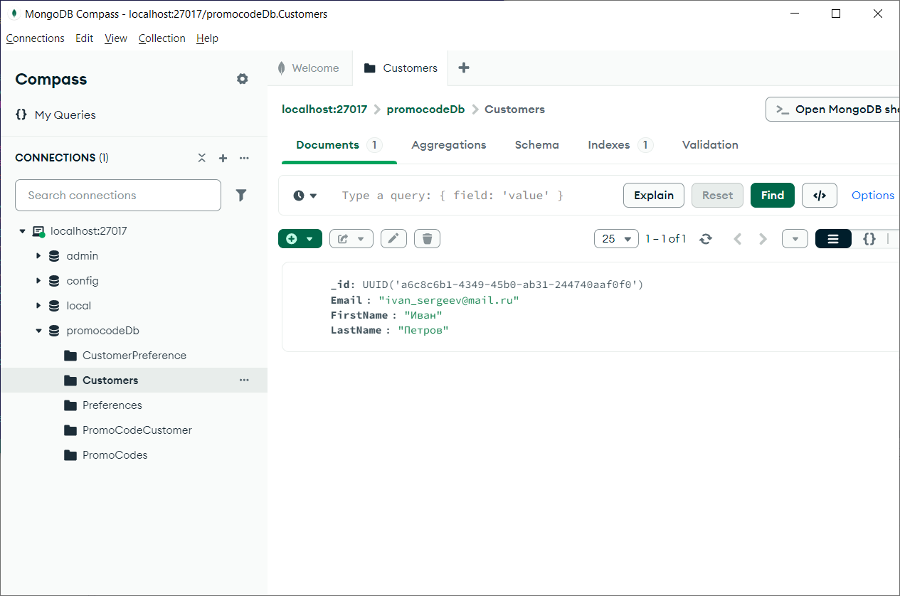
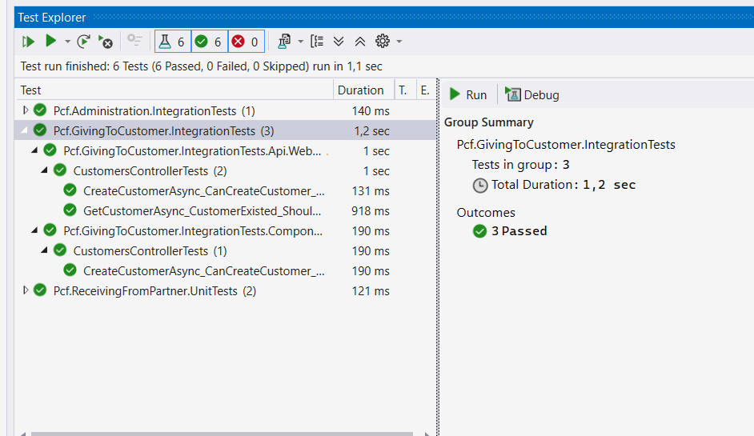

# Otus.PromoCodeFactory

## Задача

В качестве NoSQL базы использовать MongoDb и перенести туда данные и работу с ними для микросервиса "Предложение промокодов клиентам"
(Otus.Teaching.Pcf.GivingToCustomer).

## Решение

1) В файл docker-compose.yml добавлен запуск mongoDb.
	```
	#GivingToCustomer MongoDb
	promocode-factory-giving-to-customer-mongodb:
		image: mongo
		container_name: promocode-factory-giving-to-customer-mongodb
		restart: always
    	ports:
      		- "27017:27017"
    	environment:
      		MONGO_INITDB_ROOT_USERNAME: admin
      		MONGO_INITDB_ROOT_PASSWORD: docker

2) Для работы с mongoDb использован MongoDB Entity Framework Core Provider
(https://github.com/mongodb/mongo-efcore-provider).
Это позволяет не менять имплементацию работы с данными при переключении базы данных.
	
3) В GivingToCustomer.WebHost добавлен nuget пакет MongoDB.EntityFrameworkCore.
	
4) В GivingToCustomer.DataAccess DataContext конструктор добавилен флаг, чтобы MongoDb SaveContext работал.
Для демо проекта достаточно:
``` Database.AutoTransactionBehavior = AutoTransactionBehavior.Never; ```
Вообще рекомендуется поменять настройки сервера Mongo "replica set or load balanced configuration"
	
4) В файле Startup.cs в ConfigureServices убран PostgreSql и добавлена инициализация MogoDb:	
	```
	var mongoDbSettings = Configuration.GetSection(nameof(MongoDBSettings)).Get<MongoDBSettings>();
	var client = new MongoClient(mongoDbSettings.Connection);
	services.AddDbContext<DataContext>(x =>
	{
	    x.UseMongoDB(client, mongoDbSettings.DatabaseName);
	    x.UseLazyLoadingProxies();
	});
	```
	
5) GivePromoCodesToCustomersWithPreferenceAsync(GivePromoCodeRequest request) был исправлен, 
т.к. реализация MongoDb не поддерживает сложные запросы ("A number of Entity Framework Core features are not currently supported but planned for future release": 
https://github.com/mongodb/mongo-efcore-provider) 
	```
	var customerPrefs = await _customerPreferenceRepository.GetWhere(e => e.PreferenceId == request.PreferenceId);
	var customerIds = customerPrefs.Select(c => c.CustomerId).ToList();
	var customers = await _customersRepository.GetRangeByIdsAsync(customerIds);
	PromoCode promoCode = PromoCodeMapper.MapFromModel(request, preference, customers);
	await _promoCodesRepository.AddAsync(promoCode);
	```

6) Чтобы работали Promodes добавлена регистрация связей модели многие ко многим
	```
	modelBuilder.Entity<PromoCodeCustomer>()
		.HasKey(bc => bc.Id);
	modelBuilder.Entity<PromoCodeCustomer>()
		.HasAlternateKey(bc => new { bc.CustomerId, bc.PromoCodeId });
	modelBuilder.Entity<PromoCodeCustomer>()
		.HasOne(bc => bc.Customer)
		.WithMany(b => b.PromoCodes)
		.HasForeignKey(bc => bc.CustomerId);
	modelBuilder.Entity<PromoCodeCustomer>()
		.HasOne(bc => bc.PromoCode)
		.WithMany(bc => bc.Customers)
		.HasForeignKey(bc => bc.PromoCodeId);
	```

7) Для отладки использовался MongoDB Compass


8) Итого имеем 3 базовые сущности:  
	Customers  
	Preferences  
	PromoCodes

	и 2 вспомогательные:

	CustomerPreferences  
	PromoCodeCustomer

	Структура оставлена как в базе данных, для возможности переключения хранилища, и для исследования возможности Ef
	по работе с NoSql базой данных. Для реальной объектной базы данных лучше вынести таблицы CustomerPreferences, PromoCodeCustomer 
	как массивы Id в соответствующие сущности.

9) Тесты проходят, контроллеры протестированы


10) Добавлен перевод сервиса Administration на MongoDb  

В случае сервиса Administration перевод сделан по другой схеме не на MongoDB Entity Framework Core Provider, а на более низком уровне MongoDB.Driver:

EFRepository заменён на MongoRepository, где работа ведётся через IMongoCollection  

Исправлены тесты и добавлена ещё одна база в compose.yml