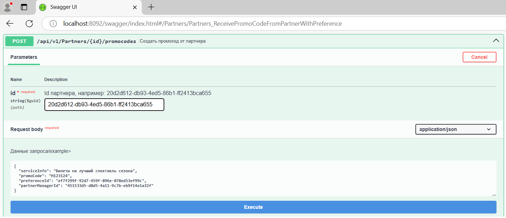

# Проект обмена сообшениями через библиотеку MassTransit и брокер сообщений RabbitMQ

**1) В compose.yml файл добавлен RabbitMq.**

**2) Изменения в проекте публикующем события Pcf.ReceivingFromPartner**
+ В проект Pcf.ReceivingFromParther подключены модули
```
	<PackageReference Include="MassTransit" Version="8.3.6" />
	<PackageReference Include="MassTransit.RabbitMQ" Version="8.3.6" />
```
+ В Pcf.ReceivingFromPartner.Integration добавлен publisher GivingPromoCodeToCustomerMassTransitGateway
+ В Startup.cs регистрация IGivingPromoCodeToCustomerGateway заменена на GivingPromoCodeToCustomerMassTransitGateway
``` 
services.AddScoped(typeof(IGivingPromoCodeToCustomerGateway), typeof(GivingPromoCodeToCustomerMassTransitGateway)); 
```
+ В Startup.cs добавлена регистрация MassTransit
```
            services.AddMassTransit(x =>
            {
                x.UsingRabbitMq((context, cfg) =>
                {
                    cfg.Host("localhost", h =>
                    {
                        h.Username("admin");
                        h.Password("docker");
                    });
                });
            });
            services.Configure<MassTransitHostOptions>(options =>
            {
                options.WaitUntilStarted = true;
                options.StartTimeout = TimeSpan.FromSeconds(30);
                options.StopTimeout = TimeSpan.FromMinutes(1);
            });
```

**3) Изменения в проекте Pcf.GivingToCustomer**
+ В проект Pcf.ReceivingFromParther подключены модули
+ Добавлен сервис PromocodesService релизующий функционал контроллера PromocodesController
+ Сервис перенесей в Core и подключен в Promocodes вместо прямой реализации
+ Добавлен класс подписки на события PromocodeConsumer.cs, также зависящий от PromocodesService 
и вызывающий в Consumer метод 
``` 
_promocodesService.GivePromoCodesToCustomersWithPreferenceAsync 
```
аналогичный контроллеру
+ Добавлена регистрация MassTransit и Consumerа в Startup.cs
    services.AddMassTransit(x =>
    {
        x.UsingRabbitMq((context, cfg) =>
        {
            cfg.Host("localhost", h =>
            {
                h.Username("admin");
                h.Password("docker");
            });
            cfg.ConfigureEndpoints(context);
        });
        x.AddConsumer<PromocodeConsumer>();
    });
+ Имя события получается в библиотеке автоматически по имени класса и namespace, поэтому добавили 
ссылку на один и тот же класс GivePromoCodeToCustomerDto в качестве идентификатора события во все проекты
``` 
public class PromocodeConsumer : IConsumer<GivePromoCodeToCustomerDto> 
```

**4) Изменения в проекте Pcf.Administration**
+ В проект Pcf.ReceivingFromParther подключены модули MassTransit
+ Аналогично вынесен сервис AppliedPromocodesService реализующий применение промокода
+ В контроллер EmployeesController метод UpdateAppliedPromocodesAsync переведен на работу через сервис
+ Добавлен подписчик PromocodeConsumer, аналогично вызывающий выдачу промокода, но через очередь.
Подписчик обрабатывает тоже сообщение, что и обработчик Pcf.GivingToCustomer
+ Добавлена регистрация masstransit и подписчика PromocodeConsumer в файл Startup.cs
+ В отличие от проекта Pcf.GivingToCustomer подписчик зарегистрирован в другую очередь
(с именем отличным от умолчания)
```
        x.AddConsumer<PromocodeConsumer>().Endpoint(p => p.Name = "AdministrationQueue");
```
В этом случае сообщение дублируется на две очереди и проекты получают его независимо
(если использовать одну очередь, то только один проект забирает сообщение)

**5) Протестирована работа сервисов**  
Сообщения отпраляются и получаются проектами независимо.  

Swagger тест пост запроса


Первый сервис опубликовал сообщение, остальные получили


В rabbitmq созданы 2 очереди

