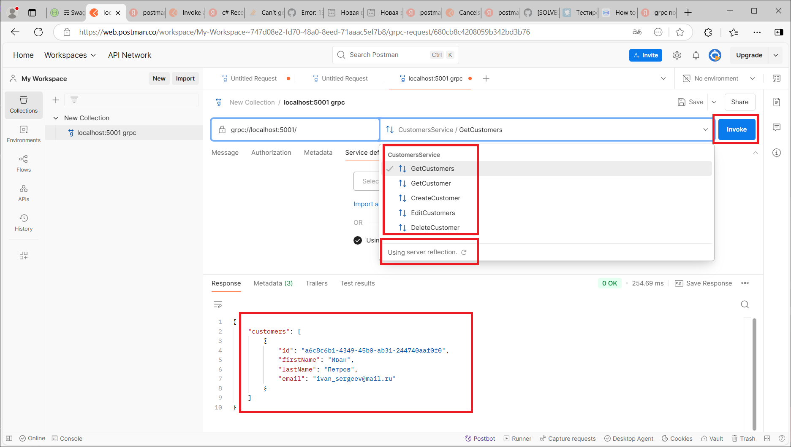

# Домашнее задание
Реализуйте в уже существующествующем сервисе Customers два подхода GRPC и GraphQL.

Выполнять задание лучше всего в виде пул реквеста к своему основному проекту по домашним заданиям. 
Если же такового нет, то можете сделать форк репозитория домашнего задания по RabbitMQ и реализовать технологии в нем.

## Реализация.

Сделан fork проекта с RabbitMQ.

### Подключаем grpc

1) Скопирован проект Pcf.GivingToCustomer.WebHost в Pcf.GivingToCustomer.GrpcHost

2) В проект Pcf.GivingToCustomer.GrpcHost в добавлены nuger пакеты grpc и зарегистрирован
модуль и рефлексия, для получения promo файлов
            services.AddGrpc();
            services.AddGrpcReflection();
            services.AddGrpcSwagger();
3) Добавлен файл описания protobuf Proto/Customers.proto и описание dto (аналогичные контроллеру)
4) Добавлен класс CustomersGrpcService пронаследованный от сгенерированного сервиса 
``` public class CustomersGrpcService : CustomersService.CustomersServiceBase  ```
5) Исправлен mapping в новые классы сгенерированные protobuf: CustomersGrpcService секция Mappings
6) Добавлена регистрация endpoints для grpc
            app.UseEndpoints(endpoints =>
            {
                endpoints.MapGrpcService<CustomersGrpcService>();
                endpoints.MapGrpcReflectionService();
            });
7) Чтобы работал grpc в postman нужно установить ssl.
launchSettings.json:
      "applicationUrl": "https://localhost:5001",
и протокол http2:
appsettings.json
	"Kestrel": {
	    "EndpointDefaults": {
	      "Protocols": "Http2"
	    }
	  }
8) В postman вводим адрес и нажимаем кнопку "Use server reflection", чтобы получить описание protobuf
с запущенного сервиса.
9) Сервисы протестированы в postman. Работают аналогично контроллерам.


### Подключаем GraphQL

1) Скопирован проект Pcf.GivingToCustomer.WebHost в Pcf.GivingToCustomer.GraphQLHost

