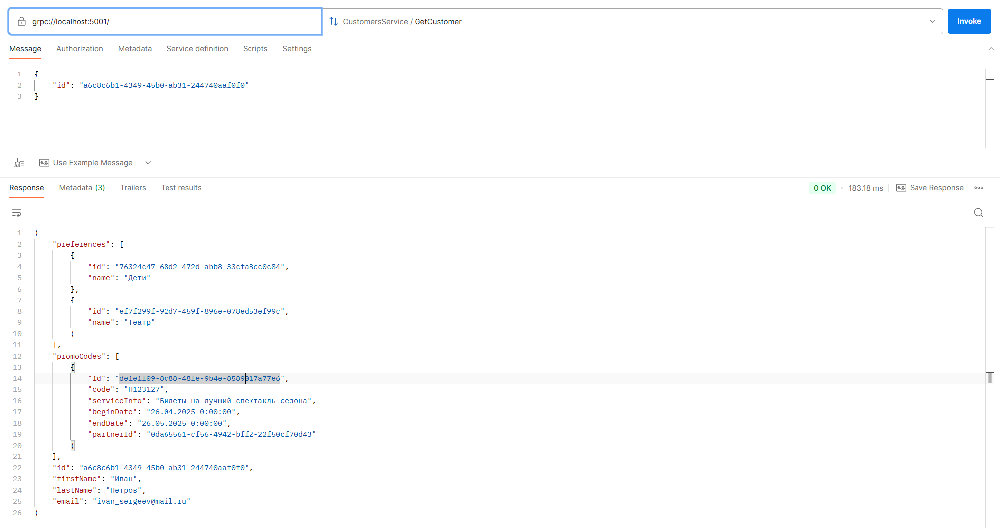
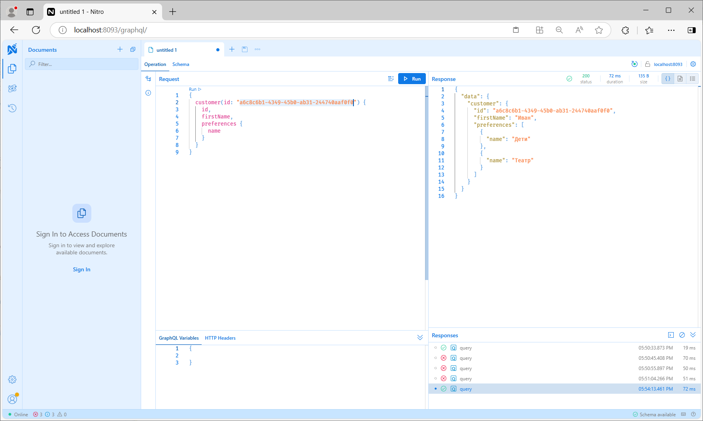
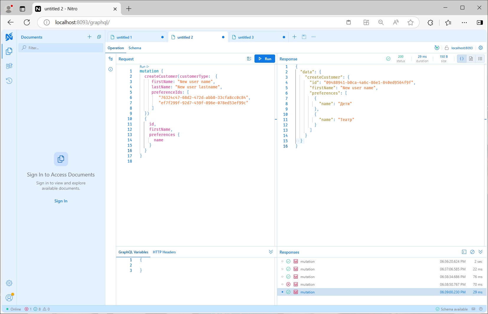
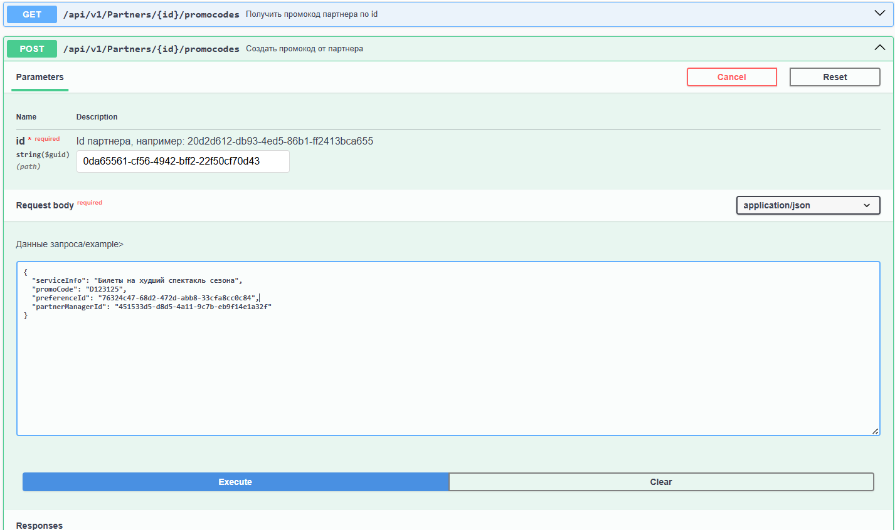
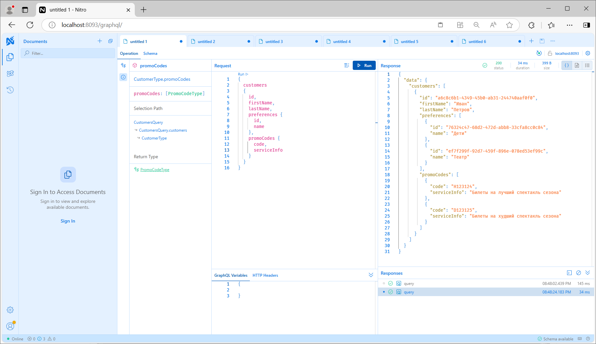

# Домашнее задание
Реализуйте в уже существующествующем сервисе Customers два подхода GRPC и GraphQL.

Выполнять задание лучше всего в виде пул реквеста к своему основному проекту по домашним заданиям. 
Если же такового нет, то можете сделать форк репозитория домашнего задания по RabbitMQ и реализовать технологии в нем.

## Реализация.

Сделан fork проекта с RabbitMQ.

### Подключаем grpc

1) Скопирован проект Pcf.GivingToCustomer.WebHost в Pcf.GivingToCustomer.GrpcHost

2) В проект Pcf.GivingToCustomer.GrpcHost в добавлены nuger пакеты grpc и зарегистрирован
модуль и рефлексия, для получения promo файлов
            services.AddGrpc();
            services.AddGrpcReflection();
            services.AddGrpcSwagger();
3) Добавлен файл описания protobuf Proto/Customers.proto и описание dto (аналогичные контроллеру)
4) Добавлен класс CustomersGrpcService пронаследованный от сгенерированного сервиса 
``` public class CustomersGrpcService : CustomersService.CustomersServiceBase  ```
5) Исправлен mapping в новые классы сгенерированные protobuf: CustomersGrpcService секция Mappings
6) Добавлена регистрация endpoints для grpc
            app.UseEndpoints(endpoints =>
            {
                endpoints.MapGrpcService<CustomersGrpcService>();
                endpoints.MapGrpcReflectionService();
            });
7) Чтобы работал grpc в postman нужно установить ssl.
launchSettings.json:
      "applicationUrl": "https://localhost:5001",
и протокол http2:
appsettings.json
	"Kestrel": {
	    "EndpointDefaults": {
	      "Protocols": "Http2"
	    }
	  }
8) В postman вводим адрес и нажимаем кнопку "Use server reflection", чтобы получить описание protobuf
с запущенного сервиса.
9) Сервисы протестированы в postman. Работают аналогично контроллерам.

10) В микросервис ReceivingFromParnter.Integration вместо MassTransit добавлен клиент gprc и 
класс нотификации через grpc GivingPromoCodeToCustomerGrpcGateway 
и при выдаче промокода клиенту, он посылает событие grpc на Customer
```
            using var channel = GrpcChannel.ForAddress("https://localhost:5001");
            var client = new CustomersService.CustomersServiceClient(channel);
            GivePromoCodeToCustomerResponse reply = await client.GivePromoCodeToCustomerAsync(request);
```



### Подключаем GraphQL

1) Скопирован проект Pcf.GivingToCustomer.WebHost в Pcf.GivingToCustomer.GraphQLHost
2) Для реализации GraphQL использовать будем библиотеку HotChocolate. Добавлен nuget:
```
      <PackageReference Include="HotChocolate.AspNetCore" Version="15.1.3" />
```
3) В папку GraphQLTypes добавлены типы CustomerType, PreferenceType, PromoCodeType, ...
4) В папку GraphQL в Pcf.GivingToCustomer.README.GraphQLHost добавлены выборки CustomersQuery.cs: 
customers, customer(id)
5) В папку GraphQL в Pcf.GivingToCustomer.README.GraphQLHost добавлены мутации CustomersMutation.cs:
CreateCustomer, EditCustomer, DeleteCustomer и GivePromoCodeToCustomer для вызова из другого проекта
6) Проинициализирован пайплайн, подключим графический интерфейс для тестов и обработчики:
```
            services.AddGraphQLServer()
                    .AddMutationType<CustomersMutation>()
                    .AddQueryType<CustomersQuery>();
```
и
```
            app.UseEndpoints(endpoints =>
            {
                endpoints.MapGraphQL();
```
7) Протестирована работа в ui. Запускаем проект, в браузере открываем 

http://localhost:8093/graphql/

Пример запроса:

Пример создания покупателя(вызова мутации):

8) В модуле Pcf.ReceivingFromPartner.Integration реализован клиент GraphQL
GivingPromoCodeToCustomerGrapgQLGateway, где отправляется запрос на GraphQL
```
var graphQLResponse = await graphQLClient.SendMutationAsync<object>(graphQLrequest);
```
9) Для реализации клиента подключены пакеты:
```
<PackageReference Include="GraphQL.Client" Version="6.1.0" />
<PackageReference Include="GraphQL.Client.Serializer.Newtonsoft" Version="6.1.0" />
```
10) Вместо MassTransit и Grpc в  Pcf.ReceivingFromPartner.Integration подключен сервис GivingPromoCodeToCustomerGrapgQLGateway
```
            //services.AddScoped(typeof(IGivingPromoCodeToCustomerGateway), typeof(GivingPromoCodeToCustomerGrpcGateway));
            services.AddScoped(typeof(IGivingPromoCodeToCustomerGateway), typeof(GivingPromoCodeToCustomerGrapgQLGateway));
```

11) Итого после добавления 2-х промокодов через restapi ReceivingFromPartner 

В сервисе GivingToCustomer получаем:

  
## The End.